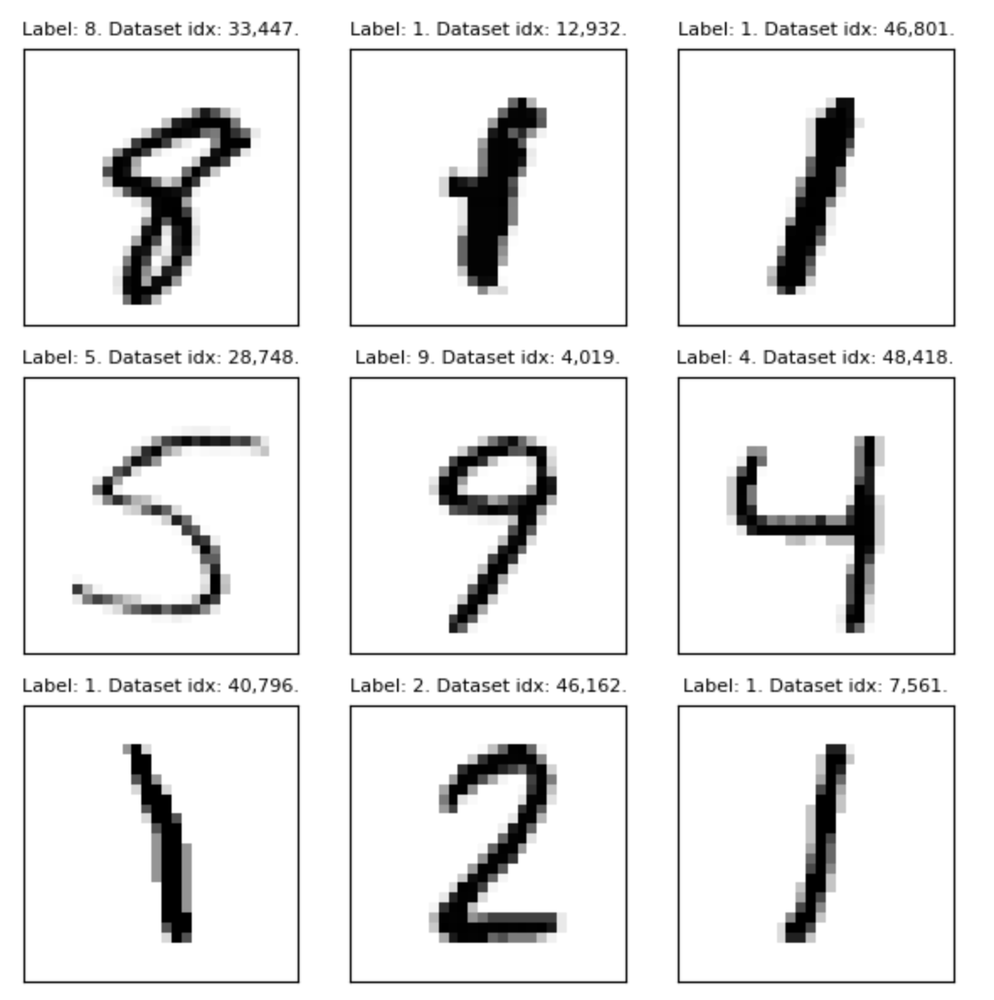

### Motivation

This repository is meant to be an educational tool for people to pull apart, inspect and play with in hopes of learning more about machine learning, and particularly the nuts and bolts underneath the glamorous surface of *Artifical Intelligence* (wooooh, ahhhh, spooky). 

### Overview

This repository provides an example of how to solve a problem with machine learning. In this case, we are solving a classic task: predicting the digit that is represented in a hand-drawn rendering. The input is a 28x28 pixel, black & white image and the output is ideally the digit (0-9) the image represents. We largely leverage the library PyTorch to solve this challenge. If you're unfamiliar, I highly recommend going through each section of the [Introduction to PyTorch](https://pytorch.org/tutorials/beginner/basics/intro.html). 

The repository is moderately well commented, but it's likely you'll need to refer to the PyTorch docs, Google or an LLM to lookup and learn concepts you're unfamiliar with. If you find yourself stumped, please feel free to reach out! (I'm wary of listing my e-mail where it can be so easily scraped, but I'm sure you can find me via some social network on the web).

**Dataset**: The [MNIST](https://en.wikipedia.org/wiki/MNIST_database) dataset of hand-written digits. Here are some examples from the training dataset. The raw datasets (train & test) are stored in the folder `raw-dataset`. The parsing of this dataset and transformation into a `pytorch.Dataset` class is handled in `dataset.py`. 

**Model**: The model or architecture is defined in `model.py`. This defines the overall function we'll be using to map from images to numbers. You can think of it as a more complex cousin of a linear regression model.

**Training**: Training is handled in `train.ipynb`. This is the process of modifying the weights in the model (or function) to do what we want. In this case, we show the model a bunch of example images (also known as a batch) and tell the model what those images should be classified as. 

**Evaluation**: Evaluation is handled in `evaluation.ipynb`. We seek to determine how well our learned black-box generalizes to unseen data (i.e. the test-set).

Here's the confusion matrix one of the models I trained achieved.
